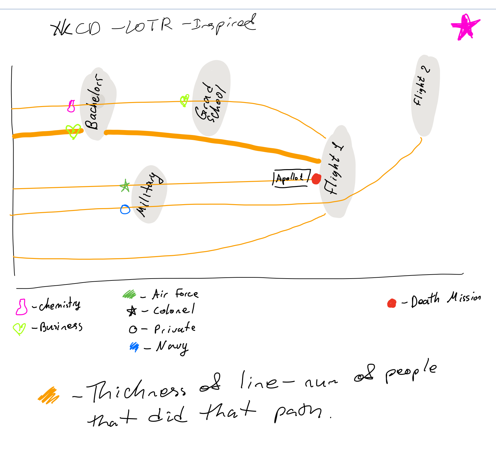
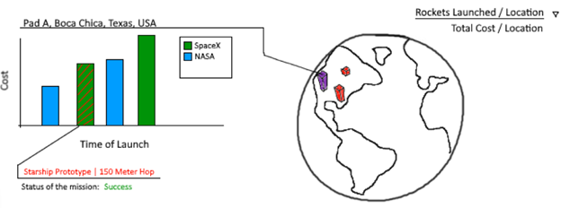
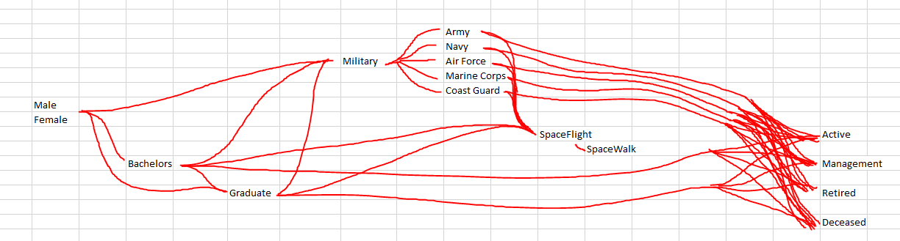

# Process Book

## Link to initial proposal:  https://docs.google.com/document/d/1ox2JzEldCwTgkCKxna-jLT34oJwoHd9bM_2vRIvY-AY/edit?usp=sharing

## Github Pages:  https://ekavtaradze.github.io/final/

### Github repo: https://github.com/ekavtaradze/final/tree/main

## Working datasets:

https://www.kaggle.com/nasa/astronaut-yearbook  

https://exploratory.io/map

## Idea Brainstorming Stage

---

At the start of the project, our group had a variety of ideas that we were interested in pursuing. While we had many good choices, we chose to focus on creating a data visualization involving NASA Astronauts and their backgrounds.

###     **Some of our brainstormed ideas can be seen down below.**

#### IDEA 1: How high can movies jump

This project would very much be for entertainment value. A few areas to explore would be to see the average jump scare over time, or movie rating and number of jump scares. We can also look at the type of scare (minor, major) and compare that with the time between scares. "https://wheresthejump.com/full-movie-list/. Unfortunately, there will be quite a bit of data processing in the sense of collecting data from the website. There is a lot of information, but we might need to build a web scraper to collect all the .srt files in order to extract all the information we need. Might also want to look into more datasets to find movie sales and cost that could also be factored in." Some timeline view would best suit the movies over the years, and it may be interesting to select individual movies and compare their timeline scales with others. Could also compare movies by budget and use of jump scares and rating. The biggest challenge would be some form of web scraper to collect the necessary data to pull something like this off.    

#### IDEA 2: The Usage of Social Media Across Different Age Groups

If we are not spending time on hw or with friends college students are likely on social media. Our group thought it may be interesting to track how much time each different age group spends on the different type of social media, and a specific respective service (snapchat, reddit, twitter....) This information could be used to help understand which
type of social media has the most usage in terms of people and time spent surfing."Currently, we would need to do some form of data mining as there is not one large dataset that contains a lot of information that we would helpful to our mission. But https://github.com/awesomedata/awesome-public-datasets#id92 has some interesting data that may be useful. "    
Bubble charts, bar charts, scatterplot graphs, and maybe network trees.Obviously this project will be difficult if there is not any consistent data that can be used for creating the graph. Additionally, our group believes that some of the information that we would need to complete this project may not be something that is easily accessible to the public.

#### IDEA 3: ** Timeline of Astronauts in Space ** (Idea that was chosen)

This idea was inspired by the website https://www.howmanypeopleareinspacerightnow.com/ With this visualization, we would create a timeline to see how many people were in space on a certain date. We are hoping to be able to add specific information about each astronaut. Example: choose a date, such as Jan 1, 2017, and our visualization should be able to show you how many people were in space at that time, and information about those astronauts. Astronaut Specific information is available as CSV and will need virtually no transformation. For the space timeline, CSV includes information about every flight from 1957 - launch time, etc. By joining these two datasets on mission names (missions flown by astronauts), we will get the needed information about who was in space at what times. The starter page shows how many people are in the space on the current date, with their names listed at the bottom of the page. Hovering over the names will bring out more information about them. At the top of the page, there is an option to change the date. Changing the date will show the corresponding number of people in space and their information.

##### Modification - IDEA 3: Timeline of Astronauts in Space

Once our team came to a consensus about the topic we were interested, we began the process of acquiring datasets that captured all the necessary information we wanted to display on the screen. It was at this point where we entered our first roadblock. In our original plan, we thought it would be possible to visually encode three following items:

1. An astronaut’s career path.

2. An astronaut’s missions.

3. A timeline of space launches.

Unfortunately, in the time that we had remaining, the datasets that were available to us as well as the time required to thoroughly clean and compile the datasets would not have left us enough time to complete the visualizations. As a team we decided to focus on the astronauts career paths. This simplified our data cleaning process to a degree and allowed us to go more in depth on the careers path and look and see how the astronauts place of birth correlated to a specific career path.

## Planning our Visual Encoding

---

Once our group decided on the topic, we began thinking of unique ways to visually encode the data.

Here were some brainstorm sketches that our team came up with:

### Final Decision for Visual Encodings Choices

After taking some time to review our initial sketches and data sets, we noticed that there was incredible diversity of career path between astronauts, and a variety of places of birth. Our group decided to strictly focus on the career path of the astronauts with interaction being provided via a world map detailing the astronauts place of birth linked to a Sankey diagram.

Map visualizations are used to analyze and display the geographically related data. This form of data is far more clear and intuitive as it is easy to visually see the distribution or proportion of data in each region. We thought it would be original and unique to see where NASA astronauts had originated from. The decision to use a Sankey diagram was motivated by the groups aim at understanding the "path" or "link" between different career paths. Sankey diagrams help show the evolution of the path (in our case career path deviations). In addition, Sankey diagrams also tell a story of where a data point comes from and where it ends (in our case this is represented by the astronaut’s place of birth and where their career took them shown in the Sankey diagram).

#### Data - Cleaning and Manipulation

The data set contained information of the astronauts and some facts about his, or her, life before NASA (college education, major, army background...). Not all the information was particularly important when constructing our Sankey diagram so we simplified the connections.
We extracted the locations of birth cities via Excel. We applied the Geography data cast to the column with birth city names, then, extracted the latitudes and longitudes. As for the map, one challenge that our group encounter were multiple astronauts listed as being born in the same city. To prevent certain points from overlapping, we introduced a point offset. In an .xsls file our group manipulated the lat and long values of a city by just enough to ensure that there was no overlap between points.

### Sources of Inspiration

- Inspired by the prof suggestion of XKCD LOTR diagram: https://xkcd.com/657/

- Interactive maps covered in class by Professor Harrison

### Issues Faced when Choosing Visual Encoding Strategy

One of the main challenges we faced while undertaking this task was finding a data set that properly incorporated all the information our group wanted to present on the screen. As mentioned previously, our group changed the original viz scheme in light of the truggles faced when joining multiple data sets.

## What Did our Visualization Teach Us?

---

### Learning outcomes from Sankey Diagram and Map

Almost all the astronauts were from the United States. Taking a deeper dive, we also see that the eastern half of the United States produces more NASA astronauts than the western half. On a global scale we see that there is minimal international representation within NASA. We also see that there is a significant disparity in the number of female astronauts in comparison to male astronauts. Lastly, our group was surprised to see so many of the astronauts arriving to NASA from a military background.

## Conclusion

---

### Improvements

- Create a more in depth Sankey diagram that details the specific major an astronaut studied during their undergraduate and graduate degrees. It may be interesting to see the degree makeup of astronauts.

- Incorporate space programs other than NASA, to see the global domain of space agencies.  

- Incorporate the corresponding space missions associated with each astronaut.

### Limitations

- Some astronauts took a very specific path which caused the lines of the Sankey diagram to be invisible (only 1px wide). To combat this we increase the line width, however this obscures the perspective as to how many people took a particular path.

- When you select multiple astronauts on the map it is not currently possible to separate them on the Sankey diagram.

### Resources Used:
- Sankey - https://bl.ocks.org/d3noob/d0212d9bdc0ad3d3e45b40d6d012e455

- Gradient links: https://bl.ocks.org/micahstubbs/3c0cb0c0de021e0d9653032784c035e9

- Astronauts Dataset: https://www.kaggle.com/nasa/astronaut-yearbook

- World Geo JSON: https://exploratory.io/map

- CSV(lat,long) to Geo JSON: https://geojson.io/#map=2/20.0/0.0
